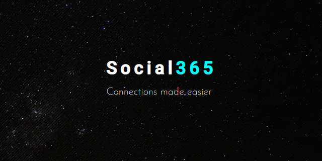
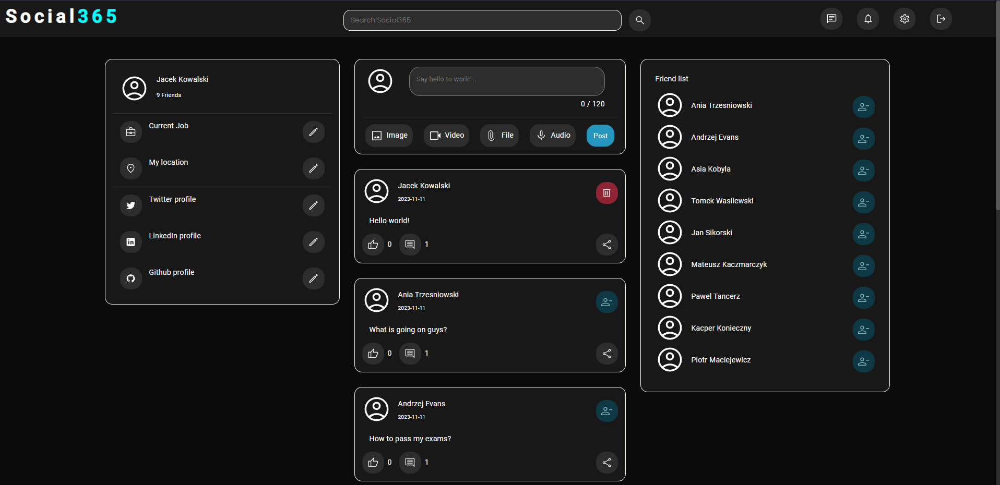
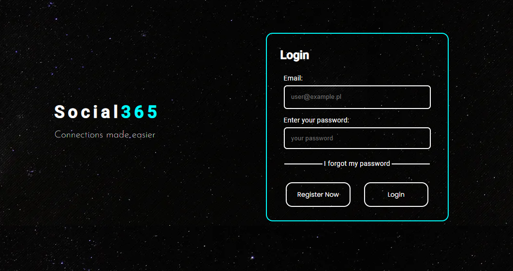
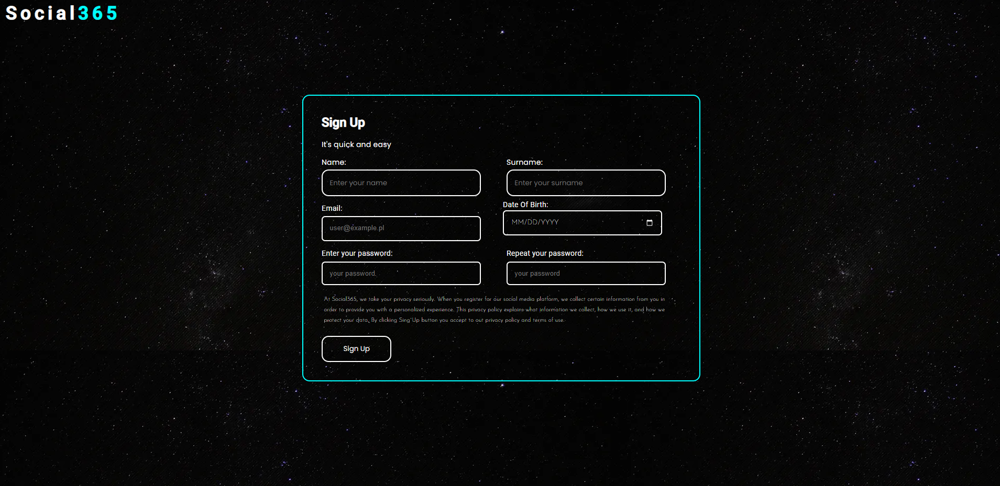
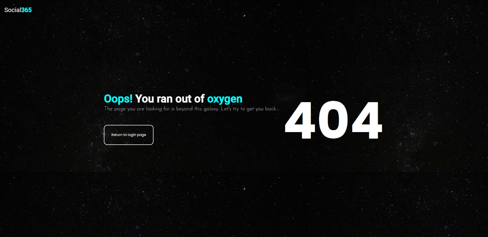
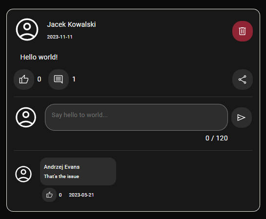
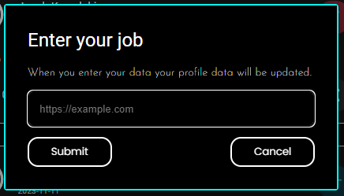

# Social App

<div align="center">
    
</div>

This is a full stack application being created during fourth semester of Computer Science studies at Warsaw University Of Technology.
Goal is to create a social media app covering frontend and backend side of such site.

## Technology stack

I used various technologies which I will list below.

### FrontEnd

* Angular 15.2.0,
* TypeScript 4.9.5,
* SCSS 1.58.3,
* Angular Material.

### BackEnd

* SpringBoot 3.0.4,
* Java JDK 17.0.6 (language level Java 11),
* Apache Maven 3.8.5,
* SpringData JPA,
* SpringSecurity,
* PostGres SQL,
* lombok,
* javadoc,
* jwt,
* jackson,
* swagger,
* logback.

### Others

* makefile,
* docker,
* postman.

## Installation of docker

To install docker use:

* On Linux:

```bash
sudo apt install -y docker
```

* On Windows:

```psh
winget install Docker.DockerDesktop
```

## Makefile commands

To simplify the development and usage of this app I used docker and makefile.
Makefile file has few commands which can be executed from the root directory.
Makefile scripts may need administrator priviliges due to *docker* command usage.

* `make`, `make all`, `make build` - uses *docker-compose* to build the whole project.
Frontend of the app will be available at `localhost:4200`,
database at `localhost:5000` and backend at `localhost:8080`

* `make clean` - command used to remove with force images created ,
during *docker-compose* build

* `make stop` - command used to turn off *docker-compose* image.

## Screenshots

* HomePage,

<div align="center">
    
</div>

* LoginPage,

<div align="center">
    
</div>

* RegisterPage,

<div align="center">
    
</div>

* NotFoundPage,

<div align="center">
    
</div>

* Posts with comments,

<div align="center">
    
</div>

* User details modification,

<div align="center">
    
</div>
